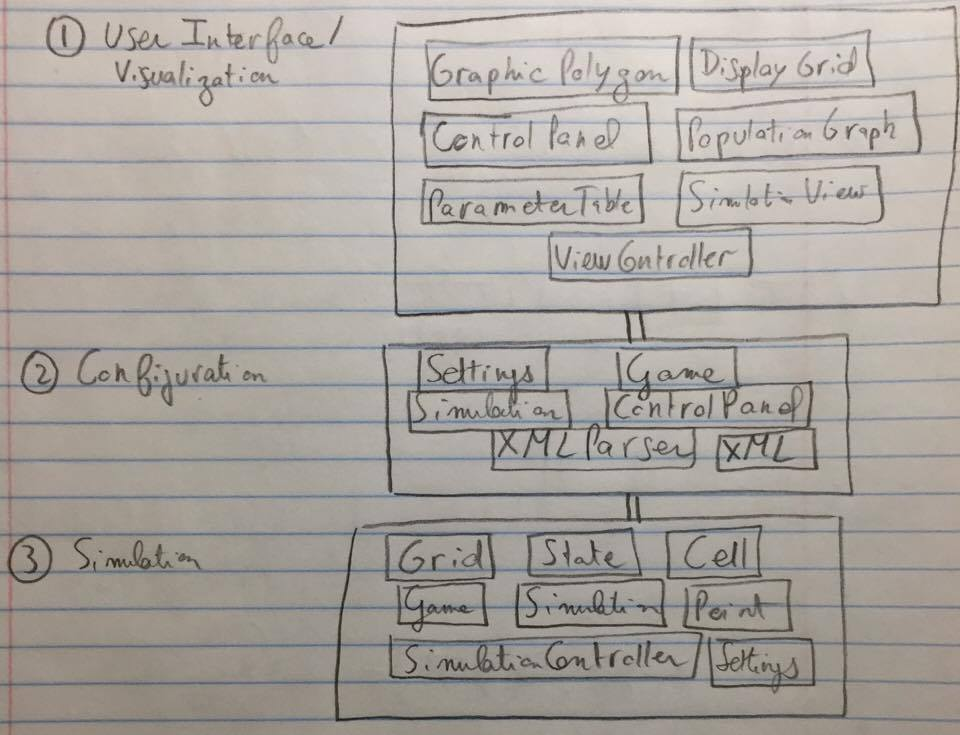
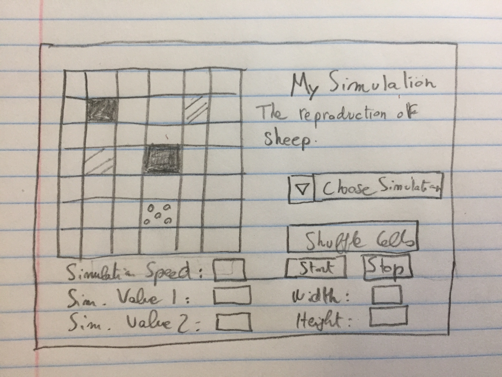

Cell Society Design
==================

## Introduction

The main difficulty that we have identified in the Cell Society project is designing a program that will be flexible enough to support many different Cellular Automata. In addition, we aspire to make a design that will be able to support the incorporation of many versatile features without changing much of our code.

We want to be able to add new types of simulations in the future, while having to change as little of our existing code as possible. We came to the conclusion that a game is primarily defined by its rules; as a consequence, we chose to encapsulate a game's rules in one coherent structure. Additionally, we want to be able to add other features into the game, such as different kinds of grids and other options for user interaction. Because of this, we organized each part of the project by its functionality and hid as much from the outside user as possible.

Each generic cell will have a specific state, which will update on each time tick. The way it will update depends on the rule that the cell's state is obeying. Every state has different rules, which is the heart of the simulations. The cell's state will have different information, depending on which simulation is being run: different colors and different rules, for instance.

The User Interface will consist of a screen on which the user sees the current state of a grid. This grid will change on each time tick. Additionally, there will be buttons for interacting with the user that will let the user do different things to tchange the functionality of the simulations. 

Through the interface, the user will be able to adjust important values for different simulations and configurations unrelated to the specific simulations. These include options such as grid type, speed, graphing capabilities and other elements of user interaction. The user will also be able to pause and play the simulation, or pick a new simulation. 

In planning CellSociety, we sought to design an organized and extensible project that promotes pain-free testing, debugging and refactoring. 

## Overview

We chose to divide our program into three layers of abstraction:

1. **The User Interface/Visualization.**

	The User Interface will have several different classes. These classes will handle the user's input, handle reading in parameters entered by the user and configurations for the appearance of the simulation and its functionality. There will also be a class that takes care of displaying the population graph and updating it on every time tick. There will be one class, called *ViewController* that holds all elements in the UI. All of these details can be seen in the picture above.
	
	There will be a separate hierarchy for displaying shapes in the grid. Here we will have a general superclass which defines methods common to all different kinds of shapes (ie squares, triangles and hexagons). There will be subclasses for each type of grid, and they will contain methods to get the locations of vertices of the shape. 

2. **The Configuration.**
	Here we will include a few classes that take care of the configuration of the program as a whole. One of these classes will be responsible for parsing and writing out XML files to read in game-related and general configuration and save. Another class will be managing these settings and applying them to affect the appearance and the functionality of the simulation. Some classes in this section will also be participating in the UI section, like the *ControlPanel* class. This class will be taking care of some configurational items but also will be displaying buttons and features to interact with the user. Our *Game* class will be a superclass that will be subclassed for each game. Each subclass will set the types of *State* it requires, and assign the proper parameters to each of those *State* objects. In addition, the *Game* superclass will be responsible for parsing XML configuration files for each game. There will be an XMLParser object, which is also used to parse in configuration files that are not specific to game, but general to all games.   
	
3. **The Simulation.** 

	We will have a *Simulation* class that will serve as a clock to our program. On each time step, the class will tell the *Grid* class to update its cells according to the rules assigned to their current states. Naturally, this class will have a *step()* method. Ideally, we'd like to keep this method minimal: we want to dissociate the actual game from our project's simulation capability. 
	
	The *Simulation* class, in other words, will simply be a chronometer for our project. Since we are required to support running multiple simulations at once, we will have a *SimulationController* class which will be in charge of overseeing all of the simulations. The *Grid* class, because it controls a Collection of *Cell* objects, will serve as the interface between the UI and the *Game* itself. The *Grid* inheritance hierarchy will contain a superclass *Grid* which will have methods that are common to all kinds of grids (ie square, triangle, hexagon). The subclasses will contain methods that are specific to the kinds of grids. The main method that will be defined in the subclasses is *getNeighbors(Point center)*. The *Cell* objects will each hold a *State* object, which will define the state of that cell and will dictate how the state changes in relation to the cells around it. Midway between the UI and the Game, the *Cell* is the basic graphic unit for our project. Each cell will have a color setter and a *getNeighbors()* method. This method will be crucial, because many rules depend on a cell's adjacent cells. Finally, each *Cell* will have a State instance variable. This variable will dictate the cell's current state and appearance. The *State* class is a description of the state of a cell. It will have a color field, which will in turn act upon the cell's color field. We will have a *chooseState()* method, which will compute the state's next state. Will have a *setNextState()* function, which will determine the state of cells for the following time step. This class will be subclassed for each different state required per simulation. 
	

We felt that these three distinct layers of abstraction gave us the best chance of retaining flexibility and modularity as the project's complexity increased. Specifically, we appreciated the *Simulation*'s role as an interface between the UI and the Game.

## User Interface

Our project's UI will use a menu similar to the one provided in the simulation attached to the Schelling’s Model of Segregation project. The user would be able to modify the grid dimensions and the delay (how quickly the simulation runs) before the game is actually launched.

When the user first opens the project, he or she would select the type of game from a scrolling menu. Before the game begins, the user will also have the ability to shuffle and randomize the cells on the board.

The descriptions of the game will be displayed under the game's name.

We will build popup screens into the interface so the user cannot begin the simulation until acceptable data has been entered. 

Pressing the “Start" button will begin the simulation. The simulation will continue until “Stop" is pressed. Pressing the “Step" button will go through one iteration of the simulation.

## Design Details 

### Details
Here we have provided details on the functionality of every major class in the program:

- There will be a *Main* class in the root of the project. It will be responsible for launching the program.

1. UI/Visualization:

- GraphicPolygon hierarchy: This hierarchy is used to generate different kinds of cells (ie square, hexagonal, triangular). The superclass, *GraphicPolygon* contains methods that are common to all three cells. Some of these are update(State state) and others. There is one abstract method defined, *getVertices(Point center)*. The subclasses represent different shapes and thus have different ways of retrieving the coordinates that define that shape. Other than this, the cells are the same.
  
- DisplayGrid: This class is used for displaying the grid given from GraphicPolygon cells. There is an update(Grid grid) method that updates all the cells in the visualization with the new states determined from the logic in the backend. This class also contains elements required for the setup of such a visualization. 

- ControlPanel: This class is used for the generation of the control panel that the user sees on the left side of the application once it is launched. It is responsible for creating the proper buttons and assigning the proper functionality to them once they are clicked. An instance of this class is maintained in the *ViewController* class.

- PopulationGraph: This class is responsible for creating and maintaining the graph of the populations of different states. There is a method to initialize the graph, update it with every tick, and clear it once a simulation is closed out. The graph also adds new series when a new simulation is loaded from the UI. 

- ParameterTable: This class is responsible for the creation and monitoring of the parameter table that is special to every game. An instance of this class is maintained in the *ControlPanel* class. This also can be seen in the UI, as it appears in the middle of the Control Panel on the left. There are methods to see when a user updated the values and pass those values to the *Game* class in the backend to take care of that respective change.

- SimulationView: This class is responsible for displaying the actual simulation. It is a window that displays individual *DisplayGrid* instances. It has methods to initialize the new window and to update the simulation on every time tick. 
 
- ViewController: This is the class that is responsible for holding all of the elements of the user interface together. It has instances of *PopulationGraph*, multiple instances of *SimulationView* because multiple simulations can be played at once, instances of *ControlPanel*, and elements from the backend such as *SimulationController*. This class also takes care of loading strings from the properties files where the proper strings for displaying to the user are defined. 

2. Configuration:

- Settings: This class is used to store and load various settings that are not pertinent to games but are just general settings like grid size or grid type. Here there are methods to get specific parameters that were read in from the XML configuration file in different formats (ie String, double, int) depending on the type of parameter requested. There are also methods to store parameters in a map that the class maintains.

- Game: This class is responsible for setting up various parameters that were read in from the XML file. These are the parameters that are pertinent to each separate simulation. This class is subclassed for every simulation implemented as the parameters are unique for every simulation. Setup for these individual games happens here. 

- Simulation: This class is responsible for receiving the configurations that are passed to it from the ControlPanel and from teh XML files. This is the class that is responsible for creating *Game* and *Grid* instances, so it is natural that the clas also handles these configuration parameters. 
  
- ControlPanel: The control panel is also responsible for passing in the configurations entered by the user. These configurations that are relevant to each game (ie the *ParameterTable*) and just general configurations are passed to their respective locations to take action. 

- XMLParser: This class acts strictly according to its name. It parses both game-related and general configuration XML files. Methods of this class are called from *Game* and from
 
- XML files: All of the configuration can be defined from the XML files. These are read when a new simulation is selected or when a configuration is changed. They are read by the XMLParser object.

3. Simulation:

- Grid: superclass will have a grid object that contains a Collection of *Cells*. Subclasses of *Grid* will be classes related to each specific kind of grid, (ie, square, triangle, hexagon). These will define the specific ways the *getNeighbors()* method works for that type of *Grid*. Since each *Cell* has a *State* instance variable, it also tells the UI what color to display the *Cell* in. Thus, *Grid* is a bridge between the backend and the frontend. 

- State: The *State* superclass will have subclasses for each of the games we need to implement as well. This is done, once again, for extensibility purposes. The states and rules according to which the next state is chosen are determined by each type of *Game*, and consist in statements that conditionally operate on the *State* of adjacent cells.

- Cell: The *Cell* class will represent one graphical unit and will  own a *State* object. The *adjacentCells()* method will return the cells adjacent to the current Cell. The Cell will also have an *update()* method, which will be invoked on each time tick. This method will take in the adjacent cells' states and the use the cell's own state and act on this information according to the cell's state's rules.

- Point: This class just represents a point in space. This object was needed in various places to relate cells to their location. This object was also needed in the front end to display the different grids.

- Game: The *Game* superclass will handle the reading in of the XML file with the initial configurations and parameter values. This will me done with an instance of *XMLParser* object. There will be different kinds of configurations for each game, so we will make an inheritance hierarchy and subclass for each new type of simulation that we are required to implement. The *Game* subclasses will also dictate which type of *State* gets which parameters. This is important because it ensures that our code is flexible and requires small amounts of modifications when being extended.

- Simulation: This class is responsible for maintaining instances of the current *Game* that is being played and the *Grid* that it is being played on. There are methods to setup the simulation, step it and shuffle it. There is also a method *getProportions()* that is used for the *PopulationMap* to display the amounts of different kinds of states present in that kind of simulation. This class owns the game loop.

- SimulationController: This class holds multiple *Simulation* objects. This was made due to the requirement that several simulations were to be run at once, and this class takes care of that feature. There are methods to step all the simulation, add a new one and remove an existing one. Additionally, there are methods to shuffle the simulations and get the proportions of the states present in each simulation for use in the *PopulationMap*.

- Settings: The settings class is responsible for maintaining the settings and configuration parameters that were read in from the XML files. This class is used as a facility to easily access and store those variables. This functionality in this class is used in *Game* and in *Simulation*.

- The *Game* superclass will handle the reading in of the XML file with the initial configurations and parameter values. This will me done with an instance of *XMLParser* object. There will be different kinds of configurations for each game, so we will make an inheritance hierarchy and subclass for each new type of simulation that we are required to implement. The *Game* subclasses will also dictate which type of *State* gets which parameters. This is important because it ensures that our code is flexible and requires small amounts of modifications when being extended.

### Use Cases
#### Apply the rules to a middle cell: set the next state of a cell to dead by counting its number of neighbors using the Game of Life rules for a cell in the middle (i.e., with all its neighbors)
1. The cell will retrieve a list of its neighbors through its *getAdjacentCells()* method. This method uses simple math to access the *Grid* and get the cells adjacent to the cell in question. 
2. Then, taking into account the *States* of its neighbors, the *Cell* will change (or not) according to the rules defined in its *State* instance variable. In this case, the *Rules* class will have a method that counts the Ccell's number of neighbors.
3. If the *Cell* changes *State*, this will be reflected in the visualization. If not, then the *Cell* will remain the same as it was on the previous time tick.

#### Apply the rules to an edge cell: set the next state of a cell to live by counting its number of neighbors using the Game of Life rules for a cell on the edge (i.e., with some of its neighbors missing)
1. The cell will retrieve a list of its neighbors through its *getAdjacentCells()* method. This method uses simple math to access the *Grid* and get the cells adjacent to the cell in question. 
2. Then, taking into account the *States* of its neighbors, the *Cell* will change (or not) according to the rules defined in its *State* instance variable. In this case, the *Rules* class will have a method that counts the Ccell's number of neighbors.
3. If the *Cell* changes *State*, this will be reflected in the visualization. If not, then the *Cell* will remain the same as it was on the previous time tick.

#### Move to the next generation: update all cells in a simulation from their current state to their next state and display the result graphically

1. The *Simulation* class will maintain the game loop. On each time tick of the simulation, all Cells in the grid will be told to update. 
2. Each *Cell* will analyze the states of its surrounding cells and chose to take an action (different actions depending on which simulation is being run). 
3. Once every cell has chosen which action to take, the program will iterate through the planned changes and resolve all conflicts (e.g. two fish trying to move to the same *Cell*).
4. The states will be updated and as a result the visualization will be updated as well.

#### Set a simulation parameter: set the value of a parameter, probCatch, for a simulation, Fire, based on the value given in an XML file
1. The *Game* class will be responsible for reading in initial parameters and configurations of the *Grid*. This will happen each time the simulation is spawned, or each time a new simulation is chosen. 
2. Next, a *Rules* subclass will be created with this parameter during the initialization, and the appropriate *State* objects will be assigned this *Rules* subclass.
3. The simulation will begin when the user presses the start button.

#### Switch simulations: use the GUI to change the current simulation from Game of Life to Wator

1. The user can pause or play the simulation.
2. The *Simulation* class will pause the simulation if and when the *IO* class tells it to. 
3. Then, the user must click on the drop-down menu on the side of the current simulation to select Wator.
4. The *IO* class will tell the *Game* class which new game to launch.
5. The *Game* class will load the new game and initialize the simulation from Wator's XML file. 
6. The *Simulation* class will start the simulation as soon as the user clicks start on the UI. 
7. The *IO* class will tell the *Simulation* class to begin.

## Design Considerations 

While planning *CellSociety*, our group discussed three main design decisions extensively: the Actor model as compared to the State model; the decision to subclass States; and our way of applying the rules.

Here were our pros and cons for each point of discussion: 

1. **The Actor model as compared to the State model.**

In the Actor model, Actors move across a grid of cells, whereas in the State model, the state of a cell is regularly set. We debated between these two approaches for quite a long time.
		
The Actor model is preferable for these reasons: 
		
- In many of these games, characters or actors are moving. Conceptually then, it might be reasonable to model these games as Actors moving over grids.
- It seems normal to ask an Actor to move, to call a method on an actor rather to set it to a new location.
		
The State model is preferable for these reasons:
		
- In these games, there are often empty cells, cells that don't move. The Actor model does not take this type of cell into account, while the State model does.
- The State abstraction is simpler, and allows us to do away with movement conceptually: we no longer need to worry about movement, and instead we just need to set the state of cells. 
		
While both abstractions had their conceptual advantages, we eventually settled on the State model. We noticed that when we were discussing the matter, our language tended to favor the "set this cell to" construction. This in itself felt like a valid reason to choose the State model.

2. **The decision to create subclasses of State**.
	
Originally, we determined that for each game, we should create subclasses of State and store them in a package related to the game. In a wildfire simulation, for instance, we would create a Fire subclass, an Empty subclass, and a Tree subclass. The alternative was to **not** manually create a number of subclasses, but instead create our States from a Game subclass (wildfire, in this situation).
		
The manual subclass model is preferable for these reasons:
		
- It is very clear what States belong to what Game. They are in the same package, as separate files.
- The implementation, while perhaps not flexible, is the simplest and most intuitive.
	
The alternative, to create our States from a Game subclass, is preferable for these reasons:
		
- It is far more flexible. For each game, we need to create one subclass (a subclass of Game), instead of many subclasses of State.
- Conceptually, our Game subclass controls and determines the behavior of the game – which is exactly what one would expect.
	
In the end, we voted for flexibility and the principle of least astonishment, and chose to create our States from within a Game subclass instead of manually subclassing each State for each game.

3. **Our way of accessing the rules.**

From the start, we felt we should have a Rules class. We debated between two different implementations, however: having every rule, for every game, in a static Rules class; or subclassing the Rules class for each Game, and storing all of one game's rules in one subclass.
		
Having every rule for every game in one Rules class is advantageous because:
		
- Similar rules can be reused between games (no code duplication in that regard).
- Each State can conveniently be initialized with an ArrayList of Rules (these rules could be called using either Reflection or Lambda Expressions).
	
Subclassing the Rules class for each game is better because:
		
- It prevents the creation of a massive, confusing Rules class.
- It circumvents the need for mistake-prone tools like Java's Reflection.
- It lets us clearly identify which rules belong to which game.
	
In the end, this choice was easy: the latter option prevailed. Subclassing the Rules class feels more flexible and robust from a coding standpoint.
	
We designed our current plan under that assumption that, to create a new game, one needs to: create a subclass of Game, and create a subclass of Rules (beyond adding an XML file with game characteristics). At this point, we are aware that combining the Game and Rules class is possible (and would make for a simpler addition of games), but we feel that would reduce our program's flexibility. We'd rather preserve flexibility at this early stage in our project!

## Team Responsibilities
The code will be split up as follows:

- Sam Schwaller will handle the User Interface code. 
- Nikita Zemlevskiy and Elliott Bolzan will split up the backend as follows:
	- Nikita will handle creating the Grid, Game and Simulation classes (and their subclasses where appropriate).
	- Elliott will handle the State, Rules, and Cell classes (and their subclasses where appropriate). 

Each of is responsible for debugging and testing our own code. These are our **primary responsibilities**. 

In addition, we will all be involved in refactoring our work together. Nikita will be responsible for merging the code when it is ready. Those are our **secondary responsibilities**.
