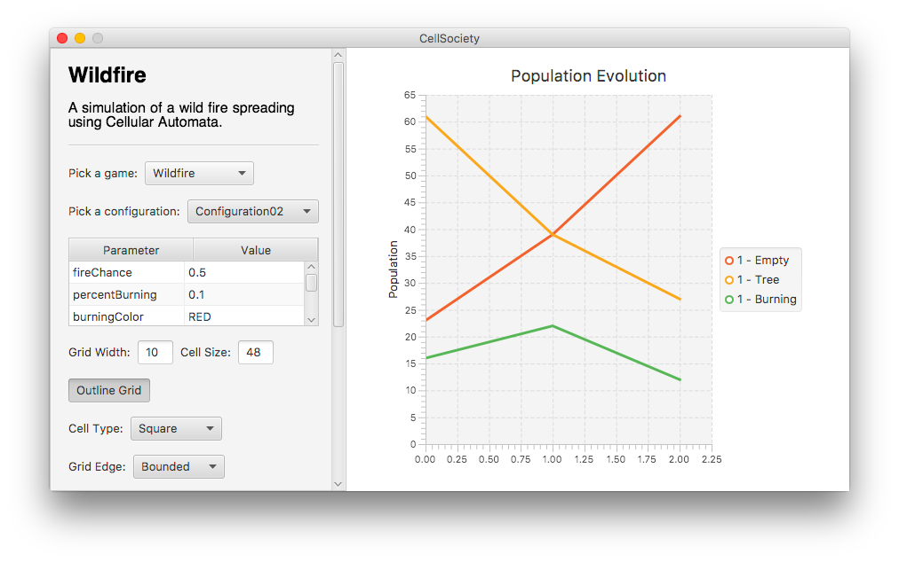
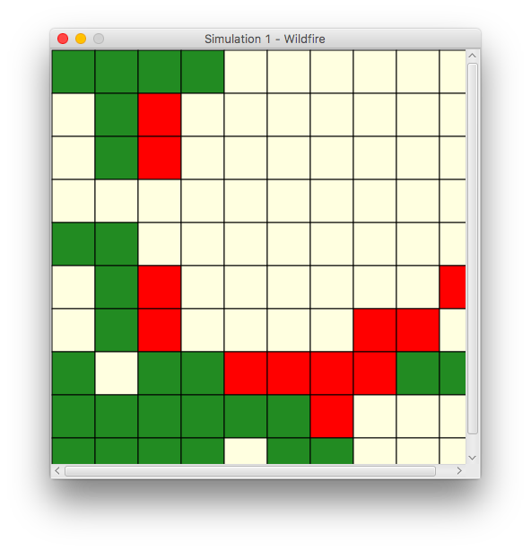
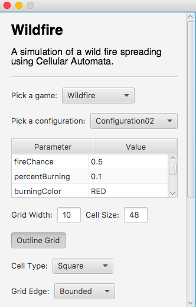
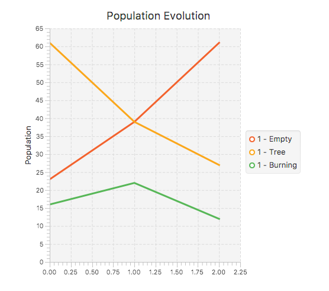

Cell Society Design
==================

## Introduction

The main difficulty that we have identified in the Cell Society project is designing a program that will be flexible enough to support many different Cell Automata.

We want to be able to add new types of simulations in the future, while having to change as little of our existing code as possible. We came to the conclusion that a game is primarily defined by its rules; as a consequence, we chose to encapsulate a game's rules in one coherent structure. 

Each generic cell will have a specific state, which will update on each time tick. The cell's state will have different information, depending on which simulation is being run: different colors and different rules, for instance.

The User Interface will consist of a screen on which the user sees the current state of a grid. This grid will change on each time tick. 

Through the interface, the user will be able to adjust important values for different simulations. The user will also be able to pause and play the simulation, or pick a new simulation. 

In planning CellSociety, we sought to design an organized project that promotes pain-free testing, debugging and refactoring. 

## Overview

We chose to divide our program into three layers of abstraction:

1. **The UI.**

	The User Interface will have an *IO* class that handles the user's input. This class will communicate the modification of important simulation parameters by the user to the *Simulation* layer of abstraction. 
	
	The *Grid* class, described in the next section, will also play a part in the UI. It will let the user visualize the current state of the simulation.

2. **The Simulation.** 

	We will have a *Simulation* class that will serve as a clock to our program. On each time step, the class will tell the *Grid* class to update its cells according to the rules assigned to their current states. Naturally, this class will have a *step()* method. Ideally, we'd like to keep this method minimal: we want to dissociate the actual game from our project's simulation capability. 
	
	The *Simulation* class, in other words, will simply be a chronometer for our project. The *Grid* class, because it controls a Collection of *Cell* objects, will serve as the interface between the UI and the *Game* itself.

3. **The Game**.

	To enhance flexibility and modularity, we have divided our *Game* section into a number of parts. 
	
- *Cell*: midway between the UI and the Game, the *Cell* is the basic graphic unit for our project. Each cell will have a color setter and a *getAdjacentCells()* method. This method will be crucial, because many rules depend on a cell's adjacent cells. Finally, each *Cell* will have a State instance variable. This variable will dictate the cell's current state and appearance.  
- *State*: a description of the state of a cell. Will have a color field, which will in turn act upon the cell's color field. Will also have a Rules instance variable, which will let the state compute its next state. Will have a *setNextState(State currentState, ArrayList<Cell> adjacentCells)* function, which will determine the state of cells for the following time step.
- *Rules*: a superclass that will be subclassed for each game. Will have a number of methods (methods that depend on the game), which will be called with a State, an ArrayList of Cell's, and which will act upon the states of the cells it was passed as a parameter.
- *Game*: a superclass that will be subclassed for each game. Each subclass will create the types of *State* it requires, and assign the proper colors and *Rules* to each of those *State* objects. In addition, the *Game* superclass will be responsible for parsing XML configuration files for each game.

We felt that these three distinct layers of abstraction gave us the best chance of retaining flexibility and modularity as the project's complexity increased. Specifically, we appreciated the *Simulation*'s role as an interface between the UI and the Game.

## User Interface

Our project's User Interface has the following apperance:

Our User Interface will be divided into three distinct sections: the Control Panel, the Graph, and the Simulation Window(s).

1\. **The Control Panel.**
The control panel is itself subdivided into several sections.

1\. *The Introductory Labels:* these serve to display the name of the selected game, and its description.
	
2\. *The Simulation Creator:* this part of the panel has as its aims to configure the simulation that will be run. From this portion, the user can select a Simulation from a Combo Box, and then select a possible Configuration for the Simulation. Configurations are general, and apply to all games. 

Once both have been selected, the user can interact with a Table View in which s/he can edit parameters for the simulation. Below this table, the user can modify the configuration parameters that were imported: the size of the grid, of cells, whether the grid is outlined, the cell type, the grid boundary behavior, the distribution of cells, and the number of neighbors taken into consideration. 

Finally, the user can either **Load** this simulation using the corresponding button, or **Save** it to disk using the corresponding button.
	
3\. *The Simulation Controller:* serves to control the simulation. The **Start** button starts the Simulation; the **Stop** button stops it; and the **Step** button progresses through one step of the Simulation. The **Reload** button shuffles the Simulation's cells. Under these buttons, a slider lets the user control the delay between each step, in milliseconds.

2\. **The Graph.**

The graph displays the evolution of the population of the running simulations. It houses the evolution of each population, for each currently loaded simulation – differentiating the population using a legend that numbers the simulations (each Simulation Window has a number). 

3\. **The Simulation Window(s).**

The Simulation Window displays an actual simulation. It is a scrollable window: if its contents are too large, the user can reach them by scrolling both vertically and horizontally. Each Simulation Window is named according to the Simulation type and the order in which it was created by the user. This is to better distinguish similar Simulations windows and similar populations on the Graph.

## Design Details 

### Details
- The *Game* superclass will handle the reading in of the XML file with the initial configurations and parameter values. These will be different for each game, so we will make an inheritance hierarchy and subclass for each new type of simulation that we are required to implement. The *Game* subclasses will also dictate which type of *State* gets which rules. This is important because it ensures that our code is flexible and requires small amounts of modifications when being extended.

- The *Simulation* class will own the game loop. The class will set the simulation's clock and time step mechanism.

- The *Grid* class will have a grid object that contains a Collection of *Cells*. The *Grid* class will be part of the User Interface as well. Since each *Cell* has a *State* instance variable, it also tells the UI what color to display the *Cell* in. Thus, *Grid* is a bridge between the backend and the frontend. 

- The *Cell* class will represent one graphical unit and will  own a *State* object. The *adjacentCells()* method will return the cells adjacent to the current Cell. The Cell will also have an *update()* method, which will be invoked on each time tick. This method will take in the adjacent cells' states and the use the cell's own state and act on this information according to the cell's state's rules. 

- The *Rules* superclass will have subclasses for each of the games we need to implement as well. In order to avoid subclassing each game's numerous *States*, we subclass *Rules* and assign an instance of these *Rules* to a *State*. This is done, once again, for extensibility purposes. The rules are determined by each type of *Game*, and consist in statements that conditionally operate on the *State* of adjacent cells.

- On the UI side, the *Grid* will handle the updating of the simulation's colors as the simulation runs. We will also have a class to handle the inputs to the User Interface and update the interface's indicators based on the state of the simulation. Input is collected through the menus and fields. We consider it important to separate the User Interface from the backend. This is done to make code more readable, organized, and easier to debug and test. 
- There will be a *Main* class in the root of the project. It will be responsible for launching the program.

### Use Cases
#### Apply the rules to a middle cell: set the next state of a cell to dead by counting its number of neighbors using the Game of Life rules for a cell in the middle (i.e., with all its neighbors)
1. The cell will retrieve a list of its neighbors through its *getAdjacentCells()* method. This method uses simple math to access the *Grid* and get the cells adjacent to the cell in question. 
2. Then, taking into account the *States* of its neighbors, the *Cell* will change (or not) according to the rules defined in its *State* instance variable. In this case, the *Rules* class will have a method that counts the Ccell's number of neighbors.
3. If the *Cell* changes *State*, this will be reflected in the visualization. If not, then the *Cell* will remain the same as it was on the previous time tick.

#### Apply the rules to an edge cell: set the next state of a cell to live by counting its number of neighbors using the Game of Life rules for a cell on the edge (i.e., with some of its neighbors missing)
1. The cell will retrieve a list of its neighbors through its *getAdjacentCells()* method. This method uses simple math to access the *Grid* and get the cells adjacent to the cell in question. 
2. Then, taking into account the *States* of its neighbors, the *Cell* will change (or not) according to the rules defined in its *State* instance variable. In this case, the *Rules* class will have a method that counts the Ccell's number of neighbors.
3. If the *Cell* changes *State*, this will be reflected in the visualization. If not, then the *Cell* will remain the same as it was on the previous time tick.

#### Move to the next generation: update all cells in a simulation from their current state to their next state and display the result graphically

1. The *Simulation* class will maintain the game loop. On each time tick of the simulation, all Cells in the grid will be told to update. 
2. Each *Cell* will analyze the states of its surrounding cells and chose to take an action (different actions depending on which simulation is being run). 
3. Once every cell has chosen which action to take, the program will iterate through the planned changes and resolve all conflicts (e.g. two fish trying to move to the same *Cell*).
4. The states will be updated and as a result the visualization will be updated as well.

#### Set a simulation parameter: set the value of a parameter, probCatch, for a simulation, Fire, based on the value given in an XML file
1. The *Game* class will be responsible for reading in initial parameters and configurations of the *Grid*. This will happen each time the simulation is spawned, or each time a new simulation is chosen. 
2. Next, a *Rules* subclass will be created with this parameter during the initialization, and the appropriate *State* objects will be assigned this *Rules* subclass.
3. The simulation will begin when the user presses the start button.

#### Switch simulations: use the GUI to change the current simulation from Game of Life to Wator

1. The user can pause or play the simulation.
2. The *Simulation* class will pause the simulation if and when the *IO* class tells it to. 
3. Then, the user must click on the drop-down menu on the side of the current simulation to select Wator.
4. The *IO* class will tell the *Game* class which new game to launch.
5. The *Game* class will load the new game and initialize the simulation from Wator's XML file. 
6. The *Simulation* class will start the simulation as soon as the user clicks start on the UI. 
7. The *IO* class will tell the *Simulation* class to begin.

## Design Considerations 

While planning *CellSociety*, our group discussed three main design decisions extensively: the Actor model as compared to the State model; the decision to subclass States; and our way of applying the rules.

Here were our pros and cons for each point of discussion: 

1\. **The Actor model as compared to the State model.**

In the Actor model, Actors move across a grid of cells, whereas in the State model, the state of a cell is regularly set. We debated between these two approaches for quite a long time.
		
The Actor model is preferable for these reasons: 
		
- In many of these games, characters or actors are moving. Conceptually then, it might be reasonable to model these games as Actors moving over grids.
- It seems normal to ask an Actor to move, or to call a method on an actor, rather than controlling it by setting a cell's state.
		
The State model is preferable for these reasons:
		
- In these games, there are often empty cells, cells that don't move. The Actor model does not take this type of cell into account, while the State model does.
- The State abstraction is simpler, and allows us to do away with movement conceptually: we no longer need to think about movement, and instead we just need to set the state of cells. 
		
While both abstractions had their conceptual advantages, we eventually settled on the State model. We noticed that when we were discussing the matter, our language tended to favor the "set this cell to" construction. This in itself felt like a valid reason to choose the State model. 

In hindsight, we are satisfied with the decisions we came to. Implementing the rules for our games was relatively painless, and the State model was not a cause for concern as we implemented our design. Adding new simulations with new rules was painless.

2\. **The decision to create subclasses of State**.
		
We struggled between two alternatives here. Either we could have one State class, and create our States from our Game subclasses (Wildfire, for example), or we could create seperate subclasses of State for every state and store them in a package related to the game. For this second scenario, in a wildfire simulation, we would create a Burning subclass, an Empty subclass, and a Tree subclass, and place the files in a Wildfire package.
	
The first model, to create our States from within a Game subclass, is preferable for these reasons:
		
- For each game, we need to create one subclass (a subclass of Game), instead of many subclasses of State.
- Conceptually, our Game subclass controls and determines the behavior of the game.

The one-State one-subclass model is preferable for these reasons:
		
- It is very clear what States belong to what Game. They are in the same package, as separate files.
- The implementation is leaner and more intuitive. The rules for each state reside in the State subclass, considerably freeing up the Game subclass.
- The implementation of rules is hidden from the Game class. We thought this was a strong argument in favor of this model: if we needed to add a new set of rules for a State, the Game did not have to know anything about it.
	
In the end, we voted for flexibility, and chose the one-State one-subclass model. This design provided the best encapsulation, isolating rules within the State subclasses they pertained to – exactly as one would expect. Our Game classes, in addition, became more focused and extendable as a consequence of our choice.

3\. **Our way of accessing the rules.**

We debated between two conceptual locations for the rules of our games: either we could have separate Rules subclasses, corresponding to each Game or State, or we could store the Rules directly within a State. 
		
Having separate Rules subclasses for each Game or State had the following advantages:
		
- Similar rules can be reused between games (no code duplication in that regard).
- Each State can be initialized with an ArrayList of Rules.
	
Placing the rules within individual State subclasses was preferable for the following reasons: 
		
- It prevents the creation of confusing Rules class.
- It circumvents the need for mistake-prone tools like Java's Reflection.
- It lets us clearly identify which rules belong to which state.
- We also noticed there was very little duplication in terms of rules: few games used the same rules. This took away one of the other model's advantages.
	
In the end, the latter option prevailed. Adding the rules to the State subclasses satisifed a good balance between extensibility and clarity: while rules could not be reused for several states, it was clearer which States obeyed which rules. This was a tradeoff we willingly accepted, and we do not regret the choice, as adding new rules was quite simple during our implementation.

---
	
We designed our current plan under that assumption that, to create a new game, one needs to: create a subclass of Game appropriate subclasses of State, and place them in a package together. While this could seem like a lot of classes to create, we valued flexibility instead of the compression of code into few classes. We are glad we took this approach, as the new features we needed to add during sprint 3 were usually to implement and integrated seamlessly.

## Team Responsibilities
Our team responsibilities, while not originally divided this way, were split up as follows:

- Nikita Zemlevskiy and Elliott Bolzan split up the backend and front end as follows:
	- Nikita created the Grid, Game and Simulation classes (and their hierarchies and subclasses where appropriate) during the second sprint. In the third sprint, Nikita worked on the implementation of new cell types, new edge behaviors, and new simulations.
	- Elliott created the State classes, the rules for each game, the Cell classes, and the User Interface (including their hierarchies and subclasses) during the second sprint. In the third sprint, Elliott worked on the possibility of simultaneous simulations, population graphs, and the configuation of simulations from XML and the UI.
- Sam Schwaller worked on testing code at the end of the second sprint, and on modifying the colors of cells in the third sprint.

Each of us was responsible for debugging and testing our own code. These were our **primary responsibilities**. 

Nikita and Elliott were responsible for the documentation and refactoring of code, as well as for the merging of branches and new features as they were developed. These were our **secondary responsibilities**.
