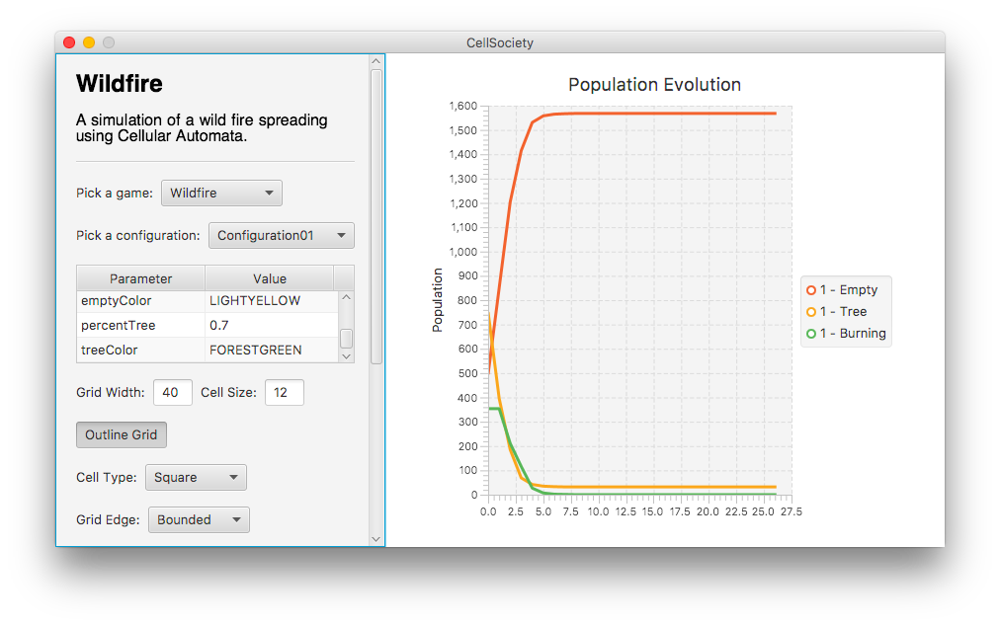
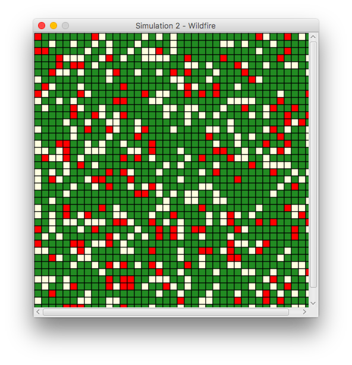
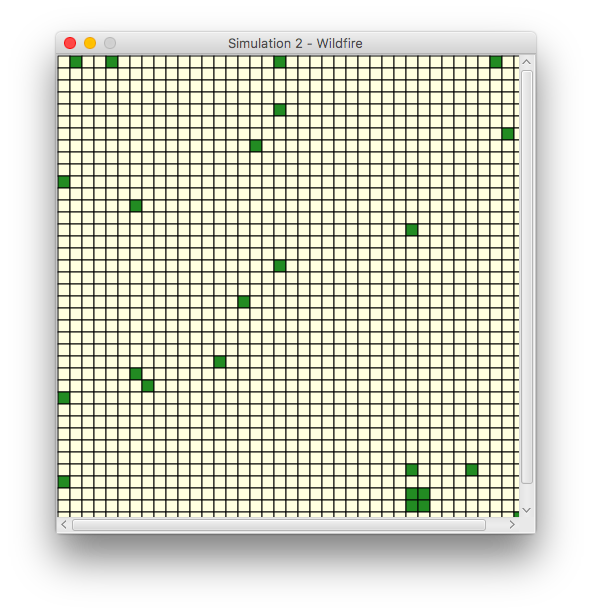
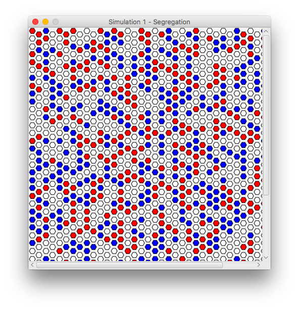
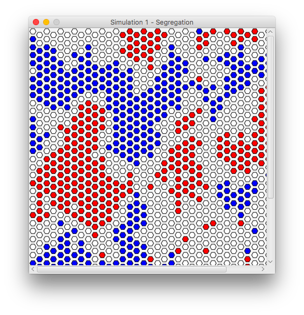

Cell Society
==========

A team project (3-person group) for Duke's Computer Science 308 (Design and Implementation). For this second project, we built a cellular-automata simulation system (approximately 3400 lines of code). This program is capable of modeling wildfires, inner-city demographics, ecosystem development, and many more phenomena.

**Files used to start the project (the class(es) containing main):**

`src/cellsociety_team18/Main.java` is the fil used to start the project.

**Files used to test the project:**

- XML configuration files may be modified to change parameters for each simulation, as well as for the general configuration of simulations. 
- Parameters for each simulation may also be set from the User Interface before the simulation is loaded. 

Our XML files are located in the `data` subfolder. When running the project, it is necessary that the `data` and `resources` subfolders be added to your Java project's build path.

**Any data or resource files required by the project (including format of non-standard files):**

- All files under `data` are XML files specifying parameters for either simulations or general configuration. They are necessary.
- All files under `resources`: these specify user-facing strings and messages.

**Any information about using the program (i.e., command-line/applet arguments, key inputs, interesting example data files, or easter eggs):**

Once our project is launched from Main, the User Interface is self-explanatory. 

- A Simulation must be picked, configured, and Loaded using the **Load** button before it can be started, stopped, stepped, or shuffled using the corresponding buttons.
- In the *Parameter* table, you will be able to click on the `Value` for different parameters pertinent to each simulation. Click on those to change them and press enter once they are changed.
- Entering a positive integer into `Grid Width` changes the amount of cells in the grid.
- Entering a positive number into `Cell Size` changes the size of each cell. 
- Selecting `Outline Grid` toggles borders between cells on the grid. 
- Using the `Cell Type` combo box, you will be able to pick between Square, Hexagonal, and Triangular cells.
- Using the `Edge Type` combo box, you will be able to pick between Toroidal and Bounded edges.
- Using the `Cell Distribution` combo box, you will be able to select the distribution of cells according to given probability parameters or a random disitrubtion.
- Using the `Number of Neighbors` field, you can select the maximum number of neighbors a cell can see. 

More specifically:

- Clicking `Load` will load the simulation from the current configuration. To load multiple simulations at once, simply specify the parameters for the new simulations and load them. 
- To quit out of a simulation just close the window.
- Click `Start` to begin the simulation. 
- If you wish to speed up the simulation, use the slider to modify the interval between each time steps.
- If you wish to stop the simulation, click `Stop`. 
- Clicking `Start` will resume the simulation.
- If you wish to step through one iteration of the simulation, stop it, then click `Step`. 
- If you wish to restart the simulation according to a new configuration, click `Reload`. 
